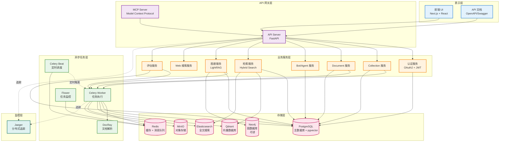
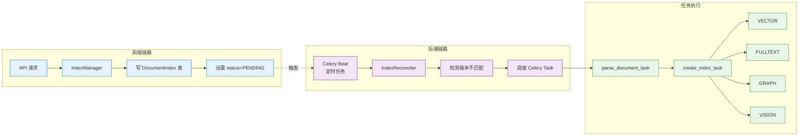
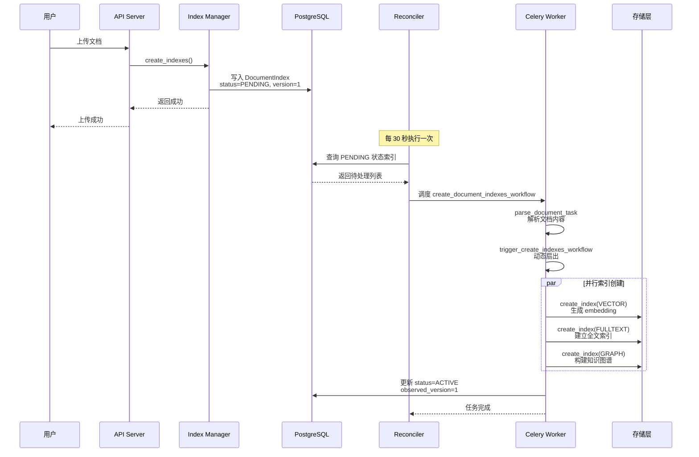
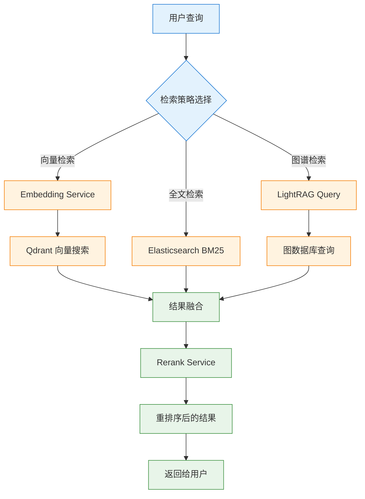
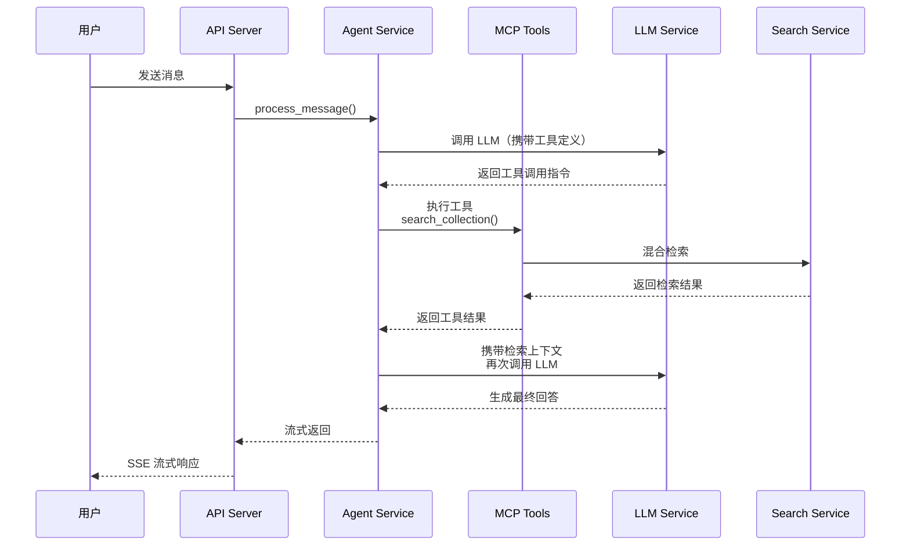

# ApeRAG 系统架构

## 1. 概述

ApeRAG 是一个生产级的 RAG（Retrieval-Augmented Generation）平台，集成了图谱 RAG、向量搜索和全文搜索能力，提供完整的知识管理和智能检索解决方案。系统采用微服务架构设计，支持水平扩展和高可用部署。

### 1.1 核心能力

- **多模态索引**：向量索引、全文索引、图谱索引、视觉索引
- **混合检索**：融合多种检索策略的智能召回和重排序
- **异步处理**：基于 Celery 的分布式任务调度系统
- **知识图谱**：基于 LightRAG 的高性能图谱构建
- **智能 Agent**：支持工具调用和多轮对话的 AI 助手
- **企业特性**：认证授权、配额管理、审计日志、多租户隔离

## 2. 系统架构总览

ApeRAG 采用典型的分层架构设计，从上到下分为表示层、服务层、任务层、存储层和基础设施层。



## 3. 分层架构详解

### 3.1 表示层

**前端 UI** (`frontend`)
- **技术栈**：Next.js 14 + React 18 + TypeScript + Ant Design
- **核心功能**：
  - Collection 管理和文档上传
  - 知识图谱可视化
  - 对话式 Bot 交互界面
  - 系统配置和用户管理
  - 评估任务管理
- **部署方式**：独立容器，通过反向代理访问后端 API

### 3.2 API 网关层

**API Server** (`api`)
- **技术栈**：FastAPI + Pydantic + SQLAlchemy
- **核心职责**：
  - RESTful API 接口暴露
  - 请求验证和响应序列化
  - 用户认证和权限控制
  - 异常处理和错误响应
  - OpenAPI 文档生成
- **关键特性**：
  - 基于 Cookie 的 Session 认证
  - 支持 OAuth2（GitHub、Google）
  - API Key 认证支持
  - 细粒度的权限控制（Admin/RW/RO）

**MCP Server**
- **协议**：Model Context Protocol
- **功能**：为 AI 助手（如 Claude Desktop）提供标准化的工具接口
- **集成**：与 API Server 共享业务逻辑

### 3.3 业务服务层

业务服务层采用 **Service-Repository** 模式，每个领域有独立的 Service 和 Repository。

#### 3.3.1 核心服务模块

**Collection Service** (`aperag/service/collection_service.py`)
- Collection（知识库）的 CRUD 管理
- Collection 配置管理（索引类型、模型选择）
- Collection 共享和市场功能

**Document Service** (`aperag/service/document_service.py`)
- 文档上传和解析协调
- 文档元数据管理
- 文档删除和更新

**Index Manager** (`aperag/index/manager.py`)
- **前端链路**：快速响应 API 请求，设置索引状态
- **索引类型**：VECTOR、FULLTEXT、GRAPH、VISION
- **状态管理**：通过 `DocumentIndex` 表跟踪索引状态和版本

**Search Service** (`aperag/query/`)
- **混合检索**：融合向量、全文、图谱多种召回策略
- **重排序**：基于 Rerank 模型的结果优化
- **过滤和聚合**：支持复杂的查询条件

**Bot/Agent Service** (`aperag/agent/`)
- 对话历史管理
- 工具调用协调
- 流式响应处理
- Session 生命周期管理

**LLM Service** (`aperag/llm/`)
- **Completion Service**：LLM 调用封装，支持多 Provider
- **Embedding Service**：向量化服务，支持批处理
- **Rerank Service**：重排序模型集成
- **统一接口**：通过 LiteLLM 支持 100+ LLM 提供商

**Graph Service** (`aperag/graph/lightrag_manager.py`)
- LightRAG 实例管理
- 知识图谱构建调度
- 实体和关系提取
- 连通分量优化

#### 3.3.2 辅助服务模块

**Authentication Service** (`aperag/auth/`)
- 用户注册和登录
- Token 生成和验证
- OAuth 回调处理

**Quota Service** (`aperag/service/quota_service.py`)
- 资源配额管理
- 使用量跟踪
- 超限检查

**Audit Service** (`aperag/service/audit_service.py`)
- 操作审计日志
- 敏感操作记录

**Marketplace Service** (`aperag/service/marketplace_service.py`)
- Collection 发布和订阅
- 权限隔离

**Web Search Service** (`aperag/websearch/`)
- Web 搜索（DuckDuckGo、JINA）
- 网页内容提取（Trafilatura、JINA Reader）

### 3.4 异步任务层

ApeRAG 的异步任务层采用 **双链路架构**：前端链路快速响应 API，后端链路通过调谐器（Reconciler）检测状态变化并调度异步任务。



#### 3.4.1 Celery Beat（定时调度器）

- **调度器类型**：DatabaseScheduler
- **核心任务**：
  - `reconcile_indexes_task`（每 30 秒）：扫描待处理的索引任务
  - 其他定期维护任务
- **持久化**：调度状态存储在 PostgreSQL

#### 3.4.2 Celery Worker（任务执行器）

**文档处理任务** (`config/celery_tasks.py`)
- `parse_document_task`：文档解析，提取文本、图片
- `create_index_task`：创建索引（VECTOR/FULLTEXT/GRAPH/VISION）
- `update_index_task`：更新索引
- `delete_index_task`：删除索引

**索引创建工作流**
```python
# 工作流编排
parse_document_task 
  -> trigger_create_indexes_workflow 
    -> group([
         create_index_task(VECTOR),
         create_index_task(FULLTEXT),
         create_index_task(GRAPH),
         create_index_task(VISION)
       ])
    -> chord callback
      -> notify_workflow_complete
```

**图谱构建任务** (`aperag/graph/lightrag_manager.py`)
- 文档分块 (`chunking_by_token_size`)
- 实体关系提取 (`extract_entities`)
- 连通分量分析 (`_find_connected_components`)
- 并发合并 (`merge_nodes_and_edges`)

**评估任务** (`aperag/tasks/evaluation.py`)
- 问题生成
- 批量评测
- 结果聚合

#### 3.4.3 Flower（任务监控）

- **Web UI**：实时查看任务状态
- **指标**：任务成功率、执行时间、队列长度
- **访问地址**：默认 `http://localhost:5555`

#### 3.4.4 DocRay（文档解析服务）

- **技术栈**：基于 MinerU 的高级文档解析
- **支持格式**：PDF、Word、PPT、Excel、图片
- **特性**：表格识别、公式提取、OCR
- **部署模式**：可选 CPU 或 GPU 加速

### 3.5 存储层

ApeRAG 采用多存储架构，针对不同数据类型选择最优存储方案。

#### 3.5.1 PostgreSQL（主数据库）

**版本**：16 + pgvector 扩展

**核心表结构**：
- **用户和权限**：`users`, `oauth_account`, `api_key`
- **Collection 和文档**：`collections`, `documents`, `document_index`
- **Bot 和对话**：`bots`, `conversations`, `messages`
- **配额和审计**：`user_quota`, `audit_log`
- **评估**：`question_sets`, `questions`, `evaluations`, `evaluation_results`
- **市场**：`collection_marketplace`, `user_collection_subscription`

**pgvector 用途**：
- 用作 Graph Index 的向量存储后端（可选）
- 支持向量相似度搜索

#### 3.5.2 Redis（缓存 + 消息队列）

**用途**：
- **Celery Broker**：任务消息队列
- **Celery Result Backend**：任务结果存储
- **应用缓存**：
  - LLM 调用缓存
  - 用户会话缓存
  - 权限缓存

**关键配置**：
- TTL：默认 86400 秒（24 小时）
- 持久化：RDB + AOF

#### 3.5.3 Qdrant（向量数据库）

**版本**：v1.13.4

**Collections**：
- 每个 ApeRAG Collection 对应一个 Qdrant Collection
- 存储文档 chunk 的 embedding 向量
- 支持过滤和混合搜索

**向量维度**：取决于 Embedding 模型（如 1024/1536/3072）

**距离度量**：Cosine（余弦相似度）

#### 3.5.4 Elasticsearch（全文搜索引擎）

**版本**：8.8.2

**索引结构**：
- 每个 Collection 对应一个 ES Index
- 存储文档的分块文本
- 支持中文分词（IK Analyzer）

**搜索特性**：
- BM25 算法
- 高亮显示
- 聚合查询

#### 3.5.5 MinIO（对象存储）

**用途**：
- 原始文档文件存储
- 上传文件的临时存储
- 解析结果的持久化

**存储结构**：
```
{bucket}/
  documents/
    {collection_id}/
      {document_id}.{ext}
  temp/
    {upload_id}.{ext}
```

**兼容性**：S3 协议兼容，支持替换为 AWS S3、阿里云 OSS 等

#### 3.5.6 Neo4j（图数据库，可选）

**用途**：
- Graph Index 的图存储后端（可选）
- 默认使用 PostgreSQL 作为图存储

**选择建议**：
- 小规模（< 10 万实体）：PostgreSQL 即可
- 大规模（> 100 万实体）：建议使用 Neo4j

## 4. 核心数据流

### 4.1 文档索引流程



### 4.2 混合检索流程



### 4.3 Agent 对话流程



## 5. 部署架构

### 5.1 Kubernetes 部署拓扑

```
┌─────────────────────────────────────────────────────────┐
│                      Ingress                            │
│              (Nginx / Traefik / Istio)                  │
└────────────────────┬────────────────────────────────────┘
                     │
        ┌────────────┴────────────┐
        │                         │
┌───────▼────────┐      ┌─────────▼────────┐
│   frontend     │      │      api         │
│   (1 replica)  │      │   (1+ replicas)  │
└────────────────┘      └──────────┬───────┘
                                   │
                    ┌──────────────┴──────────────┐
                    │                             │
          ┌─────────▼─────────┐     ┌─────────────▼────────────┐
          │  celeryworker     │     │     celerybeat           │
          │  (1+ replicas)    │     │     (1 replica)          │
          └─────────┬─────────┘     └──────────────────────────┘
                    │
          ┌─────────▼─────────┐
          │   aperag-docray   │
          │   (1 replica)     │
          └───────────────────┘

┌─────────────────────────────────────────────────────────┐
│                    Stateful Services                    │
├─────────────────────────────────────────────────────────┤
│  PostgreSQL Cluster (3 nodes)                           │
│  Redis Cluster (3 nodes)                                │
│  Qdrant Cluster (3 nodes)                               │
│  Elasticsearch Cluster (3 nodes)                        │
│  MinIO Cluster (3 nodes)                                │
└─────────────────────────────────────────────────────────┘
```

### 5.2 关键部署配置

**API 和 Celery Worker 亲和性**：
```yaml
api:
  affinity:
    podAffinity:
      requiredDuringSchedulingIgnoredDuringExecution:
        - labelSelector:
            matchLabels:
              app.aperag.io/component: celery-worker
          topologyKey: kubernetes.io/hostname
```

**原因**：API 和 Worker 需要共享本地文件系统来处理上传的文档。

**Celery Worker 反亲和性**：
```yaml
celery-worker:
  affinity:
    podAntiAffinity:
      preferredDuringSchedulingIgnoredDuringExecution:
        - weight: 100
          podAffinityTerm:
            labelSelector:
              matchLabels:
                app.aperag.io/component: celery-worker
            topologyKey: kubernetes.io/hostname
```

**原因**：避免多个 Worker 调度到同一节点，提高可用性。

### 5.3 高可用配置

| 组件 | 推荐副本数 | 状态 | 存储 |
|------|-----------|------|------|
| API | 2+ | Stateless | - |
| Frontend | 2+ | Stateless | - |
| Celery Worker | 3+ | Stateless | 共享卷（文档临时存储） |
| Celery Beat | 1 | Stateful | Redis（调度状态） |
| Flower | 1 | Stateless | - |
| PostgreSQL | 3 | Stateful | PVC + Replication |
| Redis | 3 | Stateful | PVC + Sentinel/Cluster |
| Qdrant | 3 | Stateful | PVC + Cluster |
| Elasticsearch | 3 | Stateful | PVC + Cluster |
| MinIO | 3+ | Stateful | PVC + Erasure Coding |

## 6. 关键技术特性

### 6.1 无状态架构重构（LightRAG）

**原始问题**：原版 LightRAG 使用全局状态，多任务共享实例导致并发冲突。

**解决方案**：
- 每个 Celery Task 创建独立的 LightRAG 实例
- 通过 `workspace` 参数实现 Collection 级别数据隔离
- 实体命名：`entity:{entity_name}:{workspace}`
- 关系命名：`relationship:{src}:{tgt}:{workspace}`

### 6.2 连通分量并发优化

**核心思路**：将实体关系网络分解为独立的连通分量，不同分量并行处理。

**算法**：
1. 构建实体关系邻接图
2. BFS 遍历发现连通分量
3. 分组并行处理，零锁竞争

**性能提升**：2-3 倍吞吐量（针对多样化文档集合）

### 6.3 状态驱动的索引调谐

**双链路设计**：
- **前端链路**：API 快速响应，只写数据库状态
- **后端链路**：Reconciler 定时检测状态变化，调度异步任务

**版本管理**：
- `version`：期望版本号
- `observed_version`：已处理版本号
- `version > observed_version` 触发重建

**优势**：
- API 响应时间 < 100ms
- 支持自动重试和错误恢复
- 任务失败不影响 API 可用性

### 6.4 Provider 抽象模式

**应用范围**：
- LLM Service（100+ Provider 支持）
- Embedding Service（多模型支持）
- Rerank Service（多重排序模型）
- Web Search Service（DuckDuckGo、JINA）
- Web Reader Service（Trafilatura、JINA Reader）

**核心设计**：
```python
class BaseProvider(ABC):
    @abstractmethod
    async def execute(self, **kwargs):
        pass
    
    async def close(self):
        pass

class Service:
    def __init__(self, provider_name: str):
        self.provider = self._create_provider(provider_name)
    
    async def __aenter__(self):
        return self
    
    async def __aexit__(self, *args):
        await self.provider.close()
```

### 6.5 多模态索引支持

**Vision Index 双路径**：
1. **纯视觉向量**：通过多模态 Embedding 模型生成图像向量
2. **视觉转文本**：VLM 生成图像描述 + OCR → 文本向量化

**融合策略**：
- 文本内容统一进入 Rerank
- 视觉内容按相似度排序
- 分区聚合展示

### 6.6 资源配额管理

**配额类型**：
- `max_collection_count`：最大 Collection 数
- `max_document_count`：文档总数
- `max_document_count_per_collection`：单 Collection 文档数
- `max_bot_count`：Bot 数量

**原子操作**：
```python
async def check_and_consume_quota(user_id, quota_type, amount=1):
    async with session.begin():
        quota = await session.execute(
            select(UserQuota)
            .where(...)
            .with_for_update()  # 行锁
        )
        if quota.current_usage + amount > quota.quota_limit:
            raise QuotaExceededException()
        quota.current_usage += amount
```

### 6.7 分布式追踪（OpenTelemetry）

**集成范围**：
- FastAPI 请求追踪
- SQLAlchemy 数据库查询追踪
- LLM 调用追踪
- Celery 任务追踪

**后端**：Jaeger

**用途**：
- 性能瓶颈分析
- 调用链路分析
- 异常定位

## 7. 扩展性设计

### 7.1 水平扩展能力

| 组件 | 扩展方式 | 瓶颈点 |
|------|---------|--------|
| API Server | 增加 Pod 副本数 | CPU（JSON 序列化） |
| Celery Worker | 增加 Pod 副本数 | 文档解析（CPU/Memory） |
| PostgreSQL | 读写分离 + 分片 | 写入 TPS |
| Qdrant | 增加节点数 + Sharding | 向量搜索 QPS |
| Elasticsearch | 增加节点数 + Sharding | 全文搜索 QPS |
| MinIO | 增加节点数 | 对象存储吞吐 |

### 7.2 模块化设计

**垂直拆分能力**：
- Collection 服务可独立部署
- Bot 服务可独立部署
- 图谱构建可独立部署

**水平拆分能力**：
- 按 Collection 分片
- 按用户分片
- 按地域部署

## 8. 监控和可观测性

### 8.1 健康检查

- **API Liveness**：`/health` 端点
- **API Readiness**：`/health` 端点
- **Celery Worker Liveness**：`celery status` 命令
- **Database Healthcheck**：连接池探测

### 8.2 关键指标

**业务指标**：
- Collection 数量
- 文档数量
- 索引创建成功率
- 查询 QPS
- Agent 对话次数

**系统指标**：
- API 响应时间（P50/P95/P99）
- Celery 任务队列长度
- Celery 任务成功率
- 数据库连接数
- 缓存命中率

**存储指标**：
- PostgreSQL QPS/TPS
- Redis OPS
- Qdrant 向量搜索延迟
- Elasticsearch 查询延迟
- MinIO 对象数量

### 8.3 日志聚合

**结构化日志**：
- 统一 JSON 格式
- 包含 trace_id、user_id、collection_id 等上下文
- 分级别输出（DEBUG/INFO/WARNING/ERROR）

**日志收集**：
- 标准输出 → Fluentd/Fluent Bit → Elasticsearch/Loki
- 集中式查询和分析

## 9. 安全设计

### 9.1 认证和授权

**认证方式**：
- Cookie-based Session（JWT）
- OAuth2（GitHub、Google）
- API Key

**授权模型**：
- 基于角色（RBAC）：Admin、RW、RO
- 资源级别权限检查
- Collection 所有权隔离

### 9.2 数据隔离

**多租户隔离**：
- 数据库行级隔离（user_id）
- Collection 级别隔离
- 图数据库 workspace 隔离

**敏感数据保护**：
- API Key 加密存储
- OAuth Token 加密存储
- 密码 bcrypt 加密

### 9.3 安全配置

- HTTPS 强制（生产环境）
- CORS 配置
- SQL 注入防护（ORM 参数化查询）
- XSS 防护（响应头设置）

## 10. 总结

ApeRAG 采用现代化的微服务架构设计，通过合理的分层和模块化设计实现了高性能、高可用和高扩展性。核心技术亮点包括：

1. **无状态架构**：完全重构 LightRAG，支持真正的多租户并发
2. **双链路索引**：前端快速响应，后端异步调谐
3. **多存储融合**：针对不同数据特性选择最优存储
4. **Provider 抽象**：统一接口支持多种 LLM 和服务
5. **连通分量优化**：图谱构建性能提升 2-3 倍
6. **企业级特性**：认证授权、配额管理、审计日志、分布式追踪

系统设计遵循 **关注点分离**、**单一职责** 和 **依赖倒置** 等设计原则，为构建生产级 RAG 应用提供了坚实的架构基础。

