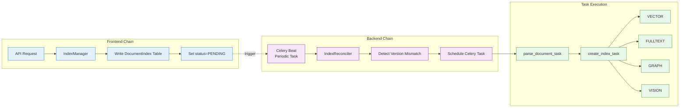
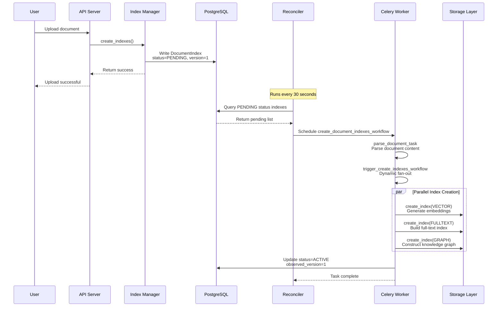
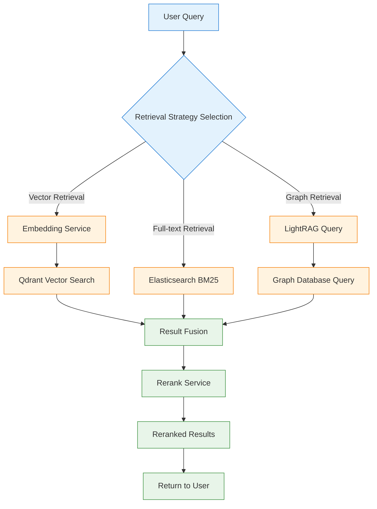
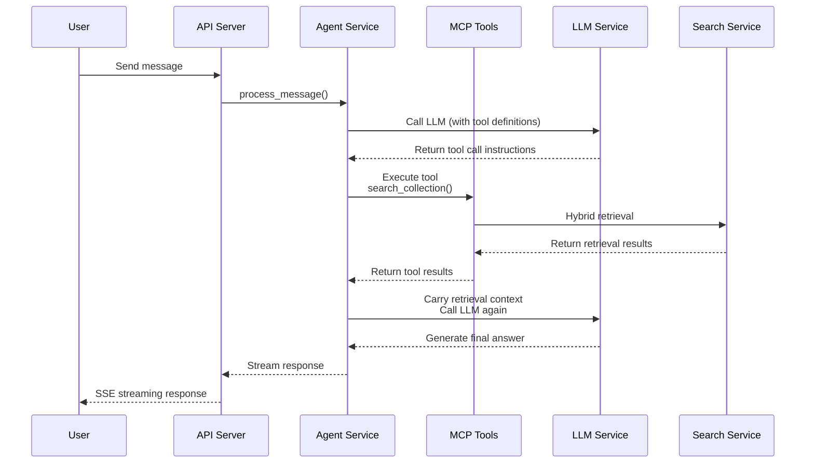

# ApeRAG System Architecture

## 1. Overview

ApeRAG is a production-ready RAG (Retrieval-Augmented Generation) platform that integrates Graph RAG, vector search, and full-text search capabilities, providing a complete knowledge management and intelligent retrieval solution. The system adopts a microservices architecture design, supporting horizontal scaling and high-availability deployment.

### 1.1 Core Capabilities

- **Multimodal Indexing**: Vector index, full-text index, graph index, vision index
- **Hybrid Retrieval**: Intelligent recall and reranking that fuses multiple retrieval strategies
- **Asynchronous Processing**: Celery-based distributed task scheduling system
- **Knowledge Graph**: High-performance graph construction based on LightRAG
- **Intelligent Agent**: AI assistant supporting tool calling and multi-turn conversations
- **Enterprise Features**: Authentication & authorization, quota management, audit logging, multi-tenant isolation

## 2. System Architecture Overview

ApeRAG adopts a typical layered architecture design, from top to bottom: Presentation Layer, Service Layer, Task Layer, Storage Layer, and Infrastructure Layer.

```mermaid
graph TB
    subgraph "Presentation Layer"
        UI[Frontend UI<br/>Next.js + React]
        API_DOCS[API Documentation<br/>OpenAPI/Swagger]
    end
    
    subgraph "API Gateway Layer"
        API[API Server<br/>FastAPI]
        MCP[MCP Server<br/>Model Context Protocol]
    end
    
    subgraph "Business Service Layer"
        AUTH[Auth Service<br/>OAuth2 + JWT]
        COLL[Collection Service]
        DOC[Document Service]
        BOT[Bot/Agent Service]
        SEARCH[Search Service<br/>Hybrid Search]
        GRAPH[Graph Service<br/>LightRAG]
        WEB[Web Search Service]
        EVAL[Evaluation Service]
    end
    
    subgraph "Async Task Layer"
        BEAT[Celery Beat<br/>Scheduler]
        WORKER[Celery Worker<br/>Task Executor]
        FLOWER[Flower<br/>Task Monitor]
        DOCRAY[DocRay<br/>Document Parser]
    end
    
    subgraph "Storage Layer"
        PG[(PostgreSQL<br/>Primary DB + pgvector)]
        REDIS[(Redis<br/>Cache + Message Queue)]
        QDRANT[(Qdrant<br/>Vector Database)]
        ES[(Elasticsearch<br/>Full-text Search)]
        MINIO[(MinIO<br/>Object Storage)]
        NEO4J[(Neo4j<br/>Graph Database<br/><i>Optional</i>)]
    end
    
    subgraph "Monitoring Layer"
        JAEGER[Jaeger<br/>Distributed Tracing]
    end
    
    UI --> API
    API_DOCS --> API
    MCP --> API
    
    API --> AUTH
    API --> COLL
    API --> DOC
    API --> BOT
    API --> SEARCH
    API --> GRAPH
    API --> WEB
    API --> EVAL
    
    COLL --> WORKER
    DOC --> WORKER
    GRAPH --> WORKER
    EVAL --> WORKER
    
    BEAT -.schedule.-> WORKER
    WORKER --> DOCRAY
    
    AUTH --> PG
    COLL --> PG
    DOC --> PG
    BOT --> PG
    SEARCH --> PG
    SEARCH --> QDRANT
    SEARCH --> ES
    GRAPH --> PG
    GRAPH --> NEO4J
    EVAL --> PG
    
    WORKER --> PG
    WORKER --> REDIS
    WORKER --> QDRANT
    WORKER --> ES
    WORKER --> MINIO
    
    BEAT --> REDIS
    FLOWER --> REDIS
    
    API -.trace.-> JAEGER
    WORKER -.trace.-> JAEGER
    
    classDef frontend fill:#e3f2fd,stroke:#1976d2,stroke-width:2px
    classDef api fill:#f3e5f5,stroke:#7b1fa2,stroke-width:2px
    classDef service fill:#fff3e0,stroke:#f57c00,stroke-width:2px
    classDef task fill:#e8f5e9,stroke:#388e3c,stroke-width:2px
    classDef storage fill:#fce4ec,stroke:#c2185b,stroke-width:2px
    classDef monitor fill:#e0f2f1,stroke:#00695c,stroke-width:2px
    
    class UI,API_DOCS frontend
    class API,MCP api
    class AUTH,COLL,DOC,BOT,SEARCH,GRAPH,WEB,EVAL service
    class BEAT,WORKER,FLOWER,DOCRAY task
    class PG,REDIS,QDRANT,ES,MINIO,NEO4J storage
    class JAEGER monitor
```



## 3. Layered Architecture Details

### 3.1 Presentation Layer

**Frontend UI** (`frontend`)
- **Tech Stack**: Next.js 14 + React 18 + TypeScript + Ant Design
- **Core Features**:
  - Collection management and document upload
  - Knowledge graph visualization
  - Conversational Bot interaction interface
  - System configuration and user management
  - Evaluation task management
- **Deployment**: Independent container, accesses backend API through reverse proxy

### 3.2 API Gateway Layer

**API Server** (`api`)
- **Tech Stack**: FastAPI + Pydantic + SQLAlchemy
- **Core Responsibilities**:
  - RESTful API endpoint exposure
  - Request validation and response serialization
  - User authentication and access control
  - Exception handling and error responses
  - OpenAPI documentation generation
- **Key Features**:
  - Cookie-based Session authentication
  - OAuth2 support (GitHub, Google)
  - API Key authentication
  - Fine-grained permission control (Admin/RW/RO)

**MCP Server**
- **Protocol**: Model Context Protocol
- **Function**: Provides standardized tool interface for AI assistants (e.g., Claude Desktop)
- **Integration**: Shares business logic with API Server

### 3.3 Business Service Layer

The business service layer adopts the **Service-Repository** pattern, with independent Service and Repository for each domain.

#### 3.3.1 Core Service Modules

**Collection Service** (`aperag/service/collection_service.py`)
- CRUD management for Collections (knowledge bases)
- Collection configuration management (index types, model selection)
- Collection sharing and marketplace features

**Document Service** (`aperag/service/document_service.py`)
- Document upload and parsing coordination
- Document metadata management
- Document deletion and updates

**Index Manager** (`aperag/index/manager.py`)
- **Frontend Chain**: Fast API response, sets index state
- **Index Types**: VECTOR, FULLTEXT, GRAPH, VISION
- **State Management**: Tracks index state and version through `DocumentIndex` table

**Search Service** (`aperag/query/`)
- **Hybrid Retrieval**: Fuses vector, full-text, and graph recall strategies
- **Reranking**: Result optimization based on Rerank models
- **Filtering and Aggregation**: Supports complex query conditions

**Bot/Agent Service** (`aperag/agent/`)
- Conversation history management
- Tool call coordination
- Streaming response handling
- Session lifecycle management

**LLM Service** (`aperag/llm/`)
- **Completion Service**: LLM call wrapper, supports multiple providers
- **Embedding Service**: Vectorization service with batch processing
- **Rerank Service**: Reranking model integration
- **Unified Interface**: Supports 100+ LLM providers through LiteLLM

**Graph Service** (`aperag/graph/lightrag_manager.py`)
- LightRAG instance management
- Knowledge graph construction scheduling
- Entity and relationship extraction
- Connected component optimization

#### 3.3.2 Auxiliary Service Modules

**Authentication Service** (`aperag/auth/`)
- User registration and login
- Token generation and validation
- OAuth callback handling

**Quota Service** (`aperag/service/quota_service.py`)
- Resource quota management
- Usage tracking
- Limit checking

**Audit Service** (`aperag/service/audit_service.py`)
- Operation audit logs
- Sensitive operation recording

**Marketplace Service** (`aperag/service/marketplace_service.py`)
- Collection publishing and subscription
- Permission isolation

**Web Search Service** (`aperag/websearch/`)
- Web search (DuckDuckGo, JINA)
- Web content extraction (Trafilatura, JINA Reader)

### 3.4 Async Task Layer

ApeRAG's async task layer adopts a **dual-chain architecture**: the frontend chain provides fast API responses, while the backend chain detects state changes through a reconciler and schedules async tasks.



#### 3.4.1 Celery Beat (Scheduler)

- **Scheduler Type**: DatabaseScheduler
- **Core Tasks**:
  - `reconcile_indexes_task` (every 30 seconds): Scans pending index tasks
  - Other periodic maintenance tasks
- **Persistence**: Schedule state stored in PostgreSQL

#### 3.4.2 Celery Worker (Task Executor)

**Document Processing Tasks** (`config/celery_tasks.py`)
- `parse_document_task`: Document parsing, extracts text and images
- `create_index_task`: Create index (VECTOR/FULLTEXT/GRAPH/VISION)
- `update_index_task`: Update index
- `delete_index_task`: Delete index

**Index Creation Workflow**
```python
# Workflow orchestration
parse_document_task 
  -> trigger_create_indexes_workflow 
    -> group([
         create_index_task(VECTOR),
         create_index_task(FULLTEXT),
         create_index_task(GRAPH),
         create_index_task(VISION)
       ])
    -> chord callback
      -> notify_workflow_complete
```

**Graph Construction Tasks** (`aperag/graph/lightrag_manager.py`)
- Document chunking (`chunking_by_token_size`)
- Entity relationship extraction (`extract_entities`)
- Connected component analysis (`_find_connected_components`)
- Concurrent merging (`merge_nodes_and_edges`)

**Evaluation Tasks** (`aperag/tasks/evaluation.py`)
- Question generation
- Batch evaluation
- Result aggregation

#### 3.4.3 Flower (Task Monitoring)

- **Web UI**: Real-time task status viewing
- **Metrics**: Task success rate, execution time, queue length
- **Access URL**: Default `http://localhost:5555`

#### 3.4.4 DocRay (Document Parsing Service)

- **Tech Stack**: Advanced document parsing based on MinerU
- **Supported Formats**: PDF, Word, PPT, Excel, images
- **Features**: Table recognition, formula extraction, OCR
- **Deployment Mode**: Optional CPU or GPU acceleration

### 3.5 Storage Layer

ApeRAG adopts a multi-storage architecture, selecting optimal storage solutions for different data types.

#### 3.5.1 PostgreSQL (Primary Database)

**Version**: 16 + pgvector extension

**Core Table Structure**:
- **Users & Permissions**: `users`, `oauth_account`, `api_key`
- **Collections & Documents**: `collections`, `documents`, `document_index`
- **Bots & Conversations**: `bots`, `conversations`, `messages`
- **Quotas & Audits**: `user_quota`, `audit_log`
- **Evaluation**: `question_sets`, `questions`, `evaluations`, `evaluation_results`
- **Marketplace**: `collection_marketplace`, `user_collection_subscription`

**pgvector Usage**:
- Used as vector storage backend for Graph Index (optional)
- Supports vector similarity search

#### 3.5.2 Redis (Cache + Message Queue)

**Usage**:
- **Celery Broker**: Task message queue
- **Celery Result Backend**: Task result storage
- **Application Cache**:
  - LLM call cache
  - User session cache
  - Permission cache

**Key Configuration**:
- TTL: Default 86400 seconds (24 hours)
- Persistence: RDB + AOF

#### 3.5.3 Qdrant (Vector Database)

**Version**: v1.13.4

**Collections**:
- Each ApeRAG Collection corresponds to one Qdrant Collection
- Stores embedding vectors of document chunks
- Supports filtering and hybrid search

**Vector Dimensions**: Depends on embedding model (e.g., 1024/1536/3072)

**Distance Metric**: Cosine similarity

#### 3.5.4 Elasticsearch (Full-text Search Engine)

**Version**: 8.8.2

**Index Structure**:
- Each Collection corresponds to one ES Index
- Stores chunked document text
- Supports Chinese tokenization (IK Analyzer)

**Search Features**:
- BM25 algorithm
- Highlighting
- Aggregation queries

#### 3.5.5 MinIO (Object Storage)

**Usage**:
- Raw document file storage
- Temporary storage for uploaded files
- Persistence of parsing results

**Storage Structure**:
```
{bucket}/
  documents/
    {collection_id}/
      {document_id}.{ext}
  temp/
    {upload_id}.{ext}
```

**Compatibility**: S3 protocol compatible, supports replacement with AWS S3, Alibaba Cloud OSS, etc.

#### 3.5.6 Neo4j (Graph Database, Optional)

**Usage**:
- Graph storage backend for Graph Index (optional)
- PostgreSQL used as graph storage by default

**Selection Guidelines**:
- Small scale (< 100K entities): PostgreSQL sufficient
- Large scale (> 1M entities): Neo4j

## 4. Core Data Flows

### 4.1 Document Indexing Flow



### 4.2 Hybrid Retrieval Flow



### 4.3 Agent Conversation Flow



## 5. Deployment Architecture

### 5.1 Kubernetes Deployment Topology

```
┌─────────────────────────────────────────────────────────┐
│                      Ingress                            │
│              (Nginx / Traefik / Istio)                  │
└────────────────────┬────────────────────────────────────┘
                     │
        ┌────────────┴────────────┐
        │                         │
┌───────▼────────┐      ┌─────────▼────────┐
│   frontend     │      │      api         │
│   (1 replica)  │      │   (1+ replicas)  │
└────────────────┘      └──────────┬───────┘
                                   │
                    ┌──────────────┴──────────────┐
                    │                             │
          ┌─────────▼─────────┐     ┌─────────────▼────────────┐
          │  celeryworker     │     │     celerybeat           │
          │  (1+ replicas)    │     │     (1 replica)          │
          └─────────┬─────────┘     └──────────────────────────┘
                    │
          ┌─────────▼─────────┐
          │   aperag-docray   │
          │   (1 replica)     │
          └───────────────────┘

┌─────────────────────────────────────────────────────────┐
│                    Stateful Services                    │
├─────────────────────────────────────────────────────────┤
│  PostgreSQL Cluster (3 nodes)                           │
│  Redis Cluster (3 nodes)                                │
│  Qdrant Cluster (3 nodes)                               │
│  Elasticsearch Cluster (3 nodes)                        │
│  MinIO Cluster (3 nodes)                                │
└─────────────────────────────────────────────────────────┘
```

### 5.2 Key Deployment Configuration

**API and Celery Worker Affinity**:
```yaml
api:
  affinity:
    podAffinity:
      requiredDuringSchedulingIgnoredDuringExecution:
        - labelSelector:
            matchLabels:
              app.aperag.io/component: celery-worker
          topologyKey: kubernetes.io/hostname
```

**Reason**: API and Worker need to share local filesystem to handle uploaded documents.

**Celery Worker Anti-affinity**:
```yaml
celery-worker:
  affinity:
    podAntiAffinity:
      preferredDuringSchedulingIgnoredDuringExecution:
        - weight: 100
          podAffinityTerm:
            labelSelector:
              matchLabels:
                app.aperag.io/component: celery-worker
            topologyKey: kubernetes.io/hostname
```

**Reason**: Avoid scheduling multiple Workers on the same node to improve availability.

### 5.3 High Availability Configuration

| Component | Recommended Replicas | State | Storage |
|-----------|---------------------|-------|---------|
| API | 2+ | Stateless | - |
| Frontend | 2+ | Stateless | - |
| Celery Worker | 3+ | Stateless | Shared volume (doc temp storage) |
| Celery Beat | 1 | Stateful | Redis (schedule state) |
| Flower | 1 | Stateless | - |
| PostgreSQL | 3 | Stateful | PVC + Replication |
| Redis | 3 | Stateful | PVC + Sentinel/Cluster |
| Qdrant | 3 | Stateful | PVC + Cluster |
| Elasticsearch | 3 | Stateful | PVC + Cluster |
| MinIO | 3+ | Stateful | PVC + Erasure Coding |

## 6. Key Technical Features

### 6.1 Stateless Architecture Refactoring (LightRAG)

**Original Problem**: Original LightRAG uses global state, multiple tasks sharing instances cause concurrency conflicts.

**Solution**:
- Each Celery Task creates independent LightRAG instance
- Collection-level data isolation through `workspace` parameter
- Entity naming: `entity:{entity_name}:{workspace}`
- Relationship naming: `relationship:{src}:{tgt}:{workspace}`

### 6.2 Connected Component Concurrency Optimization

**Core Idea**: Decompose entity relationship network into independent connected components, process different components in parallel.

**Algorithm**:
1. Build entity relationship adjacency graph
2. BFS traversal to discover connected components
3. Group parallel processing, zero lock competition

**Performance Improvement**: 2-3x throughput (for diverse document collections)

### 6.3 State-Driven Index Reconciliation

**Dual-Chain Design**:
- **Frontend Chain**: Fast API response, only writes database state
- **Backend Chain**: Reconciler periodically detects state changes, schedules async tasks

**Version Management**:
- `version`: Expected version number
- `observed_version`: Processed version number
- `version > observed_version` triggers rebuild

**Advantages**:
- API response time < 100ms
- Supports automatic retry and error recovery
- Task failures don't affect API availability

### 6.4 Provider Abstraction Pattern

**Application Scope**:
- LLM Service (100+ provider support)
- Embedding Service (multi-model support)
- Rerank Service (multiple reranking models)
- Web Search Service (DuckDuckGo, JINA)
- Web Reader Service (Trafilatura, JINA Reader)

**Core Design**:
```python
class BaseProvider(ABC):
    @abstractmethod
    async def execute(self, **kwargs):
        pass
    
    async def close(self):
        pass

class Service:
    def __init__(self, provider_name: str):
        self.provider = self._create_provider(provider_name)
    
    async def __aenter__(self):
        return self
    
    async def __aexit__(self, *args):
        await self.provider.close()
```

### 6.5 Multimodal Index Support

**Vision Index Dual Paths**:
1. **Pure Vision Vectors**: Generate image vectors through multimodal embedding models
2. **Vision-to-Text**: VLM generates image descriptions + OCR → Text vectorization

**Fusion Strategy**:
- Text content unified into Rerank
- Visual content sorted by similarity
- Partitioned aggregated display

### 6.6 Resource Quota Management

**Quota Types**:
- `max_collection_count`: Maximum Collections
- `max_document_count`: Total documents
- `max_document_count_per_collection`: Documents per Collection
- `max_bot_count`: Number of Bots

**Atomic Operations**:
```python
async def check_and_consume_quota(user_id, quota_type, amount=1):
    async with session.begin():
        quota = await session.execute(
            select(UserQuota)
            .where(...)
            .with_for_update()  # Row lock
        )
        if quota.current_usage + amount > quota.quota_limit:
            raise QuotaExceededException()
        quota.current_usage += amount
```

### 6.7 Distributed Tracing (OpenTelemetry)

**Integration Scope**:
- FastAPI request tracing
- SQLAlchemy database query tracing
- LLM call tracing
- Celery task tracing

**Backend**: Jaeger

**Usage**:
- Performance bottleneck analysis
- Call chain analysis
- Exception localization

## 7. Scalability Design

### 7.1 Horizontal Scaling Capability

| Component | Scaling Method | Bottleneck |
|-----------|---------------|------------|
| API Server | Increase Pod replicas | CPU (JSON serialization) |
| Celery Worker | Increase Pod replicas | Document parsing (CPU/Memory) |
| PostgreSQL | Read-write split + Sharding | Write TPS |
| Qdrant | Add nodes + Sharding | Vector search QPS |
| Elasticsearch | Add nodes + Sharding | Full-text search QPS |
| MinIO | Add nodes | Object storage throughput |

### 7.2 Modular Design

**Vertical Separation Capability**:
- Collection service can be deployed independently
- Bot service can be deployed independently
- Graph construction can be deployed independently

**Horizontal Separation Capability**:
- Shard by Collection
- Shard by user
- Deploy by region

## 8. Monitoring and Observability

### 8.1 Health Checks

- **API Liveness**: `/health` endpoint
- **API Readiness**: `/health` endpoint
- **Celery Worker Liveness**: `celery status` command
- **Database Healthcheck**: Connection pool probe

### 8.2 Key Metrics

**Business Metrics**:
- Collection count
- Document count
- Index creation success rate
- Query QPS
- Agent conversation count

**System Metrics**:
- API response time (P50/P95/P99)
- Celery task queue length
- Celery task success rate
- Database connections
- Cache hit rate

**Storage Metrics**:
- PostgreSQL QPS/TPS
- Redis OPS
- Qdrant vector search latency
- Elasticsearch query latency
- MinIO object count

### 8.3 Log Aggregation

**Structured Logging**:
- Unified JSON format
- Includes trace_id, user_id, collection_id and other context
- Level-based output (DEBUG/INFO/WARNING/ERROR)

**Log Collection**:
- Stdout → Fluentd/Fluent Bit → Elasticsearch/Loki
- Centralized query and analysis

## 9. Security Design

### 9.1 Authentication and Authorization

**Authentication Methods**:
- Cookie-based Session (JWT)
- OAuth2 (GitHub, Google)
- API Key

**Authorization Model**:
- Role-based (RBAC): Admin, RW, RO
- Resource-level permission checks
- Collection ownership isolation

### 9.2 Data Isolation

**Multi-tenant Isolation**:
- Database row-level isolation (user_id)
- Collection-level isolation
- Graph database workspace isolation

**Sensitive Data Protection**:
- API Key encrypted storage
- OAuth Token encrypted storage
- Password bcrypt encryption

### 9.3 Security Configuration

- HTTPS enforcement (production environment)
- CORS configuration
- SQL injection protection (ORM parameterized queries)
- XSS protection (response header settings)

## 10. Summary

ApeRAG adopts a modern microservices architecture design, achieving high performance, high availability, and high scalability through reasonable layering and modularization. Core technical highlights include:

1. **Stateless Architecture**: Complete refactoring of LightRAG, supporting true multi-tenant concurrency
2. **Dual-Chain Indexing**: Frontend fast response, backend async reconciliation
3. **Multi-Storage Fusion**: Selecting optimal storage for different data characteristics
4. **Provider Abstraction**: Unified interface supporting multiple LLMs and services
5. **Connected Component Optimization**: 2-3x improvement in graph construction performance
6. **Enterprise Features**: Authentication & authorization, quota management, audit logging, distributed tracing

The system design follows principles such as **Separation of Concerns**, **Single Responsibility**, and **Dependency Inversion**, providing a solid architectural foundation for building production-grade RAG applications.

