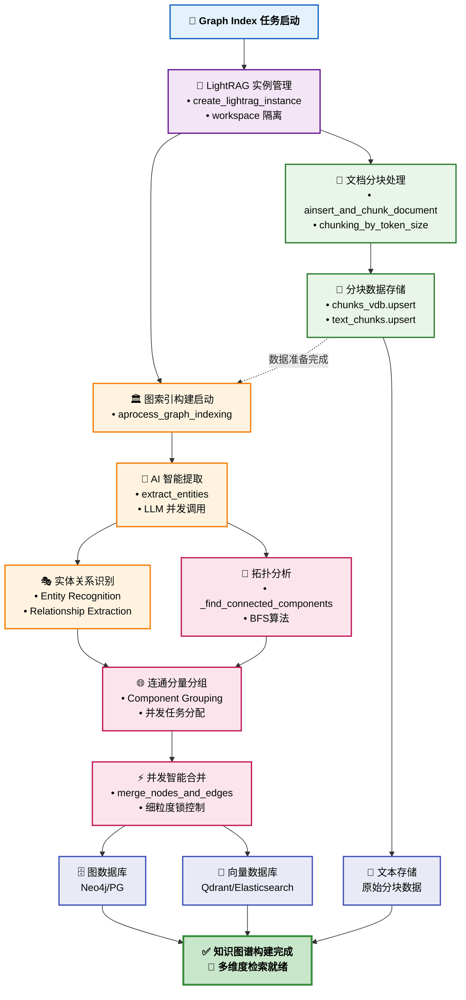
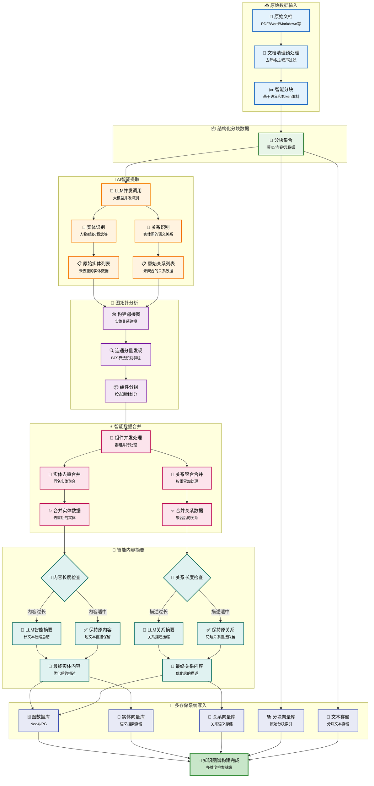

# ApeRAG Graph Index 创建流程技术文档

## 概述

ApeRAG 的 Graph Index 创建流程是整个知识图谱构建系统的核心链路，负责将原始文档转换为结构化的知识图谱。该流程基于 LightRAG 框架进行了深度重构和优化。

### 技术改进概述

原版 LightRAG 存在诸多限制：非无状态设计导致全局状态管理的并发冲突、缺乏有效的并发控制机制、存储层稳定性和一致性问题、以及粗粒度锁定影响性能等问题。**最关键的是，原版 LightRAG 不支持数据隔离，所有集合的节点和边都存储在同一个全局空间中，不同用户和项目的数据会相互冲突和污染，无法实现真正的多租户支持**。

我们针对这些问题进行了大规模重构：
- **完全重写为无状态架构**：每个任务使用独立实例，彻底解决并发冲突
- **引入 workspace 数据隔离机制**：每个集合拥有独立的数据空间，彻底解决数据冲突和污染问题
- **自研 Concurrent Control 模型**：实现细粒度锁管理，支持高并发处理
- **优化锁粒度**：从粗粒度全局锁优化为实体级和关系级精确锁定
- **重构存储层**：支持 Neo4j、PostgreSQL 等多种图数据库后端，实现可靠的多存储一致性保证
- **连通分量并发优化**：基于图拓扑分析的智能并发策略

Graph Index 创建流程主要包含以下核心阶段：
1. **任务接收与实例创建**：Celery 任务调度，LightRAG 实例初始化
2. **文档分块处理**：智能分块算法，保持语义连贯性
3. **实体关系提取**：基于 LLM 的实体和关系识别
4. **连通分量分析**：实体关系网络的拓扑分析
5. **分组并发处理**：按连通分量并发处理，提升性能
6. **节点边合并**：实体去重，关系聚合，描述摘要
7. **多存储写入**：向量数据库、图数据库的一致性写入

## 架构概览



## 核心设计思路

### 1. 无状态架构重构

原版 LightRAG 采用全局状态管理，导致严重的并发冲突，多个任务共享同一实例造成数据污染，**更严重的是所有集合的图数据都存储在同一个全局命名空间中，不同项目的实体和关系会相互混淆**，无法支持真正的多租户隔离。

我们完全重写了 LightRAG 的实例管理代码，实现了无状态设计：每个 Celery 任务创建独立的 LightRAG 实例，通过 `workspace` 参数实现集合级别的数据隔离。**每个集合的图数据都存储在独立的命名空间中**，支持 Neo4j、PostgreSQL 等多种图数据库后端，并建立了严格的实例生命周期管理机制确保资源不泄露。

### 2. 分阶段流水线处理

**文档处理与图索引分离**：
- **ainsert_and_chunk_document**：负责文档分块和存储
- **aprocess_graph_indexing**：负责图索引构建
- **优势**：模块化设计，便于测试和维护

### 3. 连通分量并发优化

原版 LightRAG 缺乏有效的并发策略，简单的全局锁导致性能瓶颈，无法充分利用多核 CPU 资源。

我们设计了基于图论的连通分量发现算法，将实体关系网络分解为独立的处理组件。通过拓扑分析驱动的智能分组并发，不同连通分量可以完全并行处理，实现零锁冲突的设计。

核心算法思路是：构建实体关系的邻接图，使用 BFS 遍历发现所有连通分量，将属于不同连通分量的实体分组到独立的处理任务中，从而实现真正的并行处理。

### 4. 细粒度并发控制机制

原版 LightRAG 缺乏有效的并发控制机制，存储操作的一致性无法保证，频繁出现数据竞争和死锁问题。

我们从零开始实现了 Concurrent Control 模型，建立了细粒度锁管理器，支持实体和关系级别的精确锁定。锁的命名采用工作空间隔离设计：`entity:{entity_name}:{workspace}` 和 `relationship:{src}:{tgt}:{workspace}`。我们设计了智能锁策略，只在合并写入时加锁，实体提取阶段完全无锁，并通过排序锁获取机制避免循环等待，预防死锁。

## 具体执行链路示例

### Graph Index 创建完整流程

以单个文档的图索引创建为例，整个处理链路包含以下关键阶段：

1. **任务接收层**：Celery 任务接收 Graph 索引创建请求，调用 LightRAG Manager

2. **LightRAG Manager 层**：为每个任务创建独立的 LightRAG 实例，确保无状态处理

3. **文档分块阶段**：
   - 内容清理和预处理
   - 基于 token 数量的智能分块（支持重叠）
   - 生成唯一的分块 ID 和元数据
   - 串行写入向量存储和文本存储

4. **图索引构建阶段**：
   - 调用 LLM 进行并发实体关系提取
   - 连通分量分析和分组处理
   - 统计提取结果

5. **实体关系提取阶段**：
   - 构建 LLM 提示模板
   - 使用信号量控制并发度
   - 支持可选的精炼提取（gleaning）
   - 解析提取结果为结构化数据

6. **连通分量分组处理**：
   - 发现连通分量并创建处理任务
   - 过滤属于每个组件的实体和关系
   - 使用信号量控制组件并发处理

7. **节点边合并阶段**：
   - 收集同名实体和同方向关系
   - 使用细粒度锁进行并发合并
   - 同步更新图数据库和向量数据库

## 核心数据流图

Graph Index 的创建过程本质上是一个复杂的数据转换流水线，以下数据流图展示了从原始文档到结构化知识图谱的完整数据转换过程：



### 数据流转换过程解析

#### 🚀 **文档输入 → 结构化分块**
原始文档经过格式清理和噪声过滤，使用智能分块算法按照语义边界和Token限制进行切分，生成带有唯一标识和元数据的分块集合。这一步骤确保了后续处理的数据质量和可追溯性。

#### 🔬 **分块数据 → AI提取结果** 
分块数据通过LLM并发调用进行智能分析，同时识别文本中的实体（人物、组织、概念等）和实体间的语义关系。这一阶段产生原始的、未经去重的实体和关系列表，为后续的图谱构建提供原材料。

#### 🧠 **提取结果 → 拓扑分组**
基于提取的实体关系构建邻接图网络，使用BFS算法发现连通分量，将相互关联的实体群组识别出来。例如：技术团队相关实体为一组，财务部门相关实体为另一组。这种拓扑分析为并行处理奠定了基础。

#### ⚡ **拓扑分组 → 智能合并**
不同的连通分量可以完全并行处理，同名实体进行智能去重和信息聚合，同方向关系进行权重累加和描述合并。这一过程将碎片化的信息整合为完整的知识单元。

#### 📝 **合并数据 → 内容优化**
对合并后的实体和关系描述进行长度检查，过长的内容通过LLM进行智能摘要压缩，确保信息密度和存储效率的平衡。短内容直接保留，长内容智能总结。

#### 💾 **优化内容 → 多维存储**
最终的知识内容同时写入多个存储系统：
- **图数据库**：存储实体节点和关系边，支持图谱查询
- **向量数据库**：存储语义向量，支持相似性搜索
- **文本存储**：保留原始分块，支持全文检索

这种多维存储架构确保了知识图谱在不同查询场景下的最优性能。

### 数据流优化特性

#### 1. 细粒度并发控制
我们实现了精确到实体和关系级别的锁定机制：`entity:{entity_name}:{workspace}` 和 `relationship:{src}:{tgt}:{workspace}`，将锁范围最小化到只在合并写入时加锁，实体提取阶段完全并行。通过排序后的锁获取顺序，有效防止循环等待和死锁。

#### 2. 连通分量驱动的并发优化
我们设计了基于 BFS 算法的拓扑分析，发现独立的实体关系网络，将其分组并行处理。不同连通分量完全独立处理，实现零锁竞争，同时按组件分批处理，有效控制内存峰值。

#### 3. 智能数据合并策略
我们实现了基于 entity_name 的智能实体去重，支持多个描述片段的智能拼接和摘要，对关系强度进行量化累积，并建立了完整的数据血缘关系记录机制。

## 性能优化策略

### 1. 连通分量优化

**拓扑驱动的并发策略**：
- **独立处理**：不同连通分量完全并行处理
- **锁竞争最小化**：组件内实体不会跨组件冲突
- **内存效率**：按组件分批处理，控制内存使用

系统会自动统计连通分量的分布情况，包括组件总数、最大组件大小、平均组件大小、单实体组件数量和大型组件数量，用于性能调优和资源分配。

### 2. LLM 调用优化

**批处理和缓存策略**：
- **并发控制**：使用信号量限制并发 LLM 调用
- **批处理优化**：相似内容的批量处理
- **缓存机制**：实体描述摘要的缓存复用

系统会智能检查描述长度，当超出token阈值时自动调用LLM生成摘要，并支持摘要结果的缓存复用以提高效率。

### 3. 存储写入优化

**批量写入和连接复用**：
- **批量操作**：减少数据库往返次数
- **连接池**：复用数据库连接
- **异步写入**：并行写入不同存储系统

### 4. 内存管理优化

**流式处理和内存控制**：
- **分块处理**：大文档的流式分块
- **及时释放**：处理完成后立即释放内存
- **监控告警**：内存使用量监控

## 代码组织结构

### 目录结构

```
aperag/
├── graph/                        # 图索引核心模块
│   ├── lightrag_manager.py      # LightRAG 管理器（Celery 入口）
│   └── lightrag/                 # LightRAG 核心实现
│       ├── lightrag.py          # 主要 LightRAG 类
│       ├── operate.py           # 核心操作函数
│       ├── base.py              # 基础接口定义
│       ├── utils.py             # 工具函数
│       ├── prompt.py            # 提示词模板
│       └── kg/                  # 知识图谱存储实现
│           ├── neo4j_sync_impl.py    # Neo4j 同步实现
│           └── postgres_sync_impl.py # PostgreSQL 同步实现
├── concurrent_control/           # 并发控制模块
│   ├── manager.py               # 锁管理器
│   └── protocols.py             # 锁接口定义
└── tasks/                       # 任务模块
    └── document.py              # 文档处理业务逻辑

config/
└── celery_tasks.py              # Celery 任务定义
```

### 核心接口设计

#### LightRAG 管理接口
负责实例创建、文档处理和删除的入口管理，以及嵌入函数和LLM函数的动态生成。

#### LightRAG 核心接口  
实现文档分块存储、图索引构建、文档删除、连通分量发现和分组处理等核心功能。

#### 操作函数接口
提供实体提取、节点边合并、分块处理等底层操作函数，支持异步并发执行。

### 数据结构设计

#### 核心数据模型

系统使用统一的数据结构设计：

- **分块数据**：包含token数量、内容、顺序索引、文档ID和文件路径
- **实体数据**：包含实体名称、类型、描述、来源ID和创建时间戳
- **关系数据**：包含源实体、目标实体、描述、关键词、权重和来源信息
- **连通分量数据**：包含组件索引、实体列表、过滤结果和组件总数

所有数据结构都支持多来源聚合，使用分隔符（如 `|`）合并多个来源信息。

## 性能监控和调试

### 1. 性能指标

**关键性能指标（KPI）**：
- **文档处理吞吐量**：每分钟处理的文档数
- **实体提取准确率**：提取实体的质量评估
- **连通分量分布**：拓扑结构的复杂度分析
- **LLM 调用效率**：平均响应时间和并发度
- **存储写入性能**：数据库操作的延迟统计

### 2. 调试工具

**结构化日志记录**：
系统提供完整的结构化日志记录功能，包括实体提取进度跟踪、实体合并详情记录、关系合并状态监控等。日志会记录处理进度百分比、实体关系数量统计、摘要生成类型等关键信息。

### 3. 性能分析

**执行时间统计**：
通过性能装饰器对关键函数进行执行时间统计，包括实体提取、节点边合并等核心操作的耗时分析，便于性能优化和瓶颈定位。

## 配置和环境

### 1. 核心配置参数

**LightRAG 配置**：
系统支持丰富的配置参数调优，包括分块大小、重叠大小、LLM并发数、相似度阈值、批处理大小、摘要参数、嵌入Token限制等。默认配置针对中文环境优化，支持根据实际需求灵活调整。

### 2. 存储配置

**多存储后端支持**：
```bash
# 环境变量配置
GRAPH_INDEX_KV_STORAGE=PGOpsSyncKVStorage          # KV 存储
GRAPH_INDEX_VECTOR_STORAGE=PGOpsSyncVectorStorage  # 向量存储  
GRAPH_INDEX_GRAPH_STORAGE=Neo4JSyncStorage         # 图存储

# PostgreSQL 配置
POSTGRES_HOST=127.0.0.1
POSTGRES_PORT=5432
POSTGRES_DB=postgres
POSTGRES_USER=postgres
POSTGRES_PASSWORD=postgres

# Neo4J 配置示例
NEO4J_HOST=127.0.0.1
NEO4J_PORT=7687
NEO4J_USERNAME=neo4j
NEO4J_PASSWORD=password
```

## 总结

我们对原版 LightRAG 进行了大规模的重构和优化，实现了真正适用于生产环境的高并发知识图谱构建系统：

> 🔬 **算法深入**：关于实体提取与合并的具体算法实现，继续阅读 [LightRAG 实体提取与合并机制详解](./lightrag_entity_extraction_and_merging_zh.md)

### 核心技术贡献

1. **彻底重写为无状态架构**：我们完全重写了 LightRAG 的核心架构，解决了原版的无法并发执行的问题，每个任务使用独立实例，支持真正的多租户隔离
2. **自研 Concurrent Control 模型**：我们设计了细粒度锁管理系统，实现实体和关系级别的精确并发控制
3. **连通分量并发优化**：我们设计了基于图拓扑分析的智能并发策略，最大化并行处理效率
4. **重构存储层架构**：我们完全重写了存储抽象层，解决原版存储实现不可靠的问题，多存储后端实现不一致的问题
5. **端到端数据流设计**：我们设计了完整的数据转换流水线，从文档分块到多存储写入的全链路优化

---

## 相关文档

- 📋 [索引链路架构设计](./indexing_architecture_zh.md) - 整体索引架构
- 📖 [LightRAG 实体提取与合并机制详解](./lightrag_entity_extraction_and_merging_zh.md) - 核心算法详解
- 🏗️ [Graph Index Creation Process](./graph_index_creation.md) - English Version
